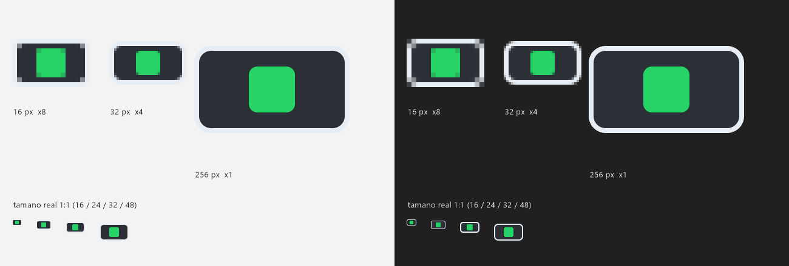

# Web Watch Companion

Convierte cualquier dispositivo con navegador en una **pantalla de alerta secundaria**. Hoy
avisa de los mensajes de WhatsApp Desktop: un ícono de WhatsApp gris que se ilumina en verde
cuando llega un mensaje, para enterarte sin mirar el celular ni depender de sonidos mientras
jugás en la PC. Pensado para un iPhone 6s viejo en horizontal, cargando junto al monitor.

Corre en Windows como un servidor pequeño con un ícono en la bandeja del sistema. Lee las
notificaciones de WhatsApp Desktop del Centro de notificaciones de Windows y las manda por
WebSocket al navegador del dispositivo.



## Instalar

Descargá `WebWatchCompanion-Setup-<versión>.exe`, ejecutalo y listo: no necesitás instalar
Node.js ni nada más. Guía paso a paso (incluye el aviso de SmartScreen y el del firewall) en
**[docs/INSTALL.md](docs/INSTALL.md)**.

## Documentación

| Quiero… | Leer |
|---|---|
| Instalar y usar la app | [docs/INSTALL.md](docs/INSTALL.md) |
| Generar y publicar el instalador | [docs/DISTRIBUTION.md](docs/DISTRIBUTION.md) |
| Entender cómo funciona por dentro | [docs/ARCHITECTURE.md](docs/ARCHITECTURE.md) |
| Ver cómo funciona la bandeja del sistema | [docs/TRAY.md](docs/TRAY.md) |
| Trabajar en el código | [docs/DEVELOPMENT.md](docs/DEVELOPMENT.md) |
| Resolver un problema | [docs/TROUBLESHOOTING.md](docs/TROUBLESHOOTING.md) |
| Saber por qué se decidió algo | [docs/DECISIONS.md](docs/DECISIONS.md) |
| Ver qué falta hacer | [ROADMAP.md](ROADMAP.md) |

## Desarrollo en un minuto

```bash
npm install
node server.js          # abrí http://<IP de la PC>:47613 en el dispositivo
npm run dist            # genera dist/WebWatchCompanion-Setup-<versión>.exe
```

Detalles en [docs/DEVELOPMENT.md](docs/DEVELOPMENT.md).

## Estructura

```
server.js            servidor (Express + WebSocket + lectura de notificaciones)
public/index.html    cliente que se abre en el dispositivo
config.json          puerto (47613)
tray/                ícono de bandeja y lanzador sin ventana
installer/           script de Inno Setup
tools/               build del instalador y generador del ícono
docs/                documentación
```
